# Generating Model from Geti™

This guide walks you through the process of installing Geti™, setting up a pallet defect detection project, training a model, and deploying it.

## Prerequisites

- [Minimum Requirements for Geti™ Installation](https://docs.geti.intel.com/docs/user-guide/getting-started/installation/using-geti-installer#minimum-requirements).
- A system capable of running Geti™ Platform
- Internet connection for downloading Geti™ and datasets
- Access to images for training your defect detection model

## Installation Steps

For detailed Geti™ platform installation instructions, refer to the [Geti™ Installer Documentation](https://docs.geti.intel.com/docs/user-guide/getting-started/installation/using-geti-installer).

> **Note:** The standard Geti™ platform installation includes the following steps:
> 1. Download the Geti™ platform installer
> 2. Extract the installer archive
> 3. Prepare the system by creating necessary directories
> 4. Run the platform installer with appropriate system privileges
>
> Please follow the official installation guide for the most up-to-date and accurate installation procedures.
>
> Upon successful completion, you will see the installation success confirmation as shown below:
>
> 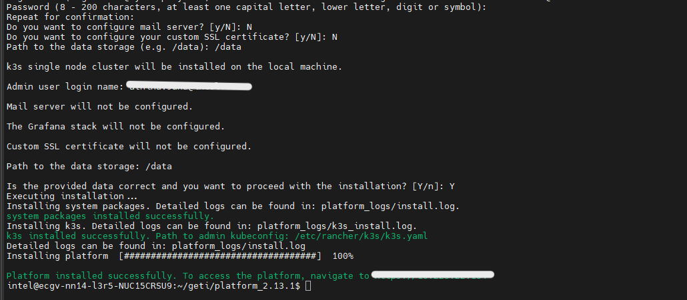

## Setting Up Your Project

### Step 4: Sign In to Geti™

Open `https://<host_ip>` in your browser, where `<host_ip>` is the IP address of the system where you installed Geti™ server. Sign in with credential which was set during installation:

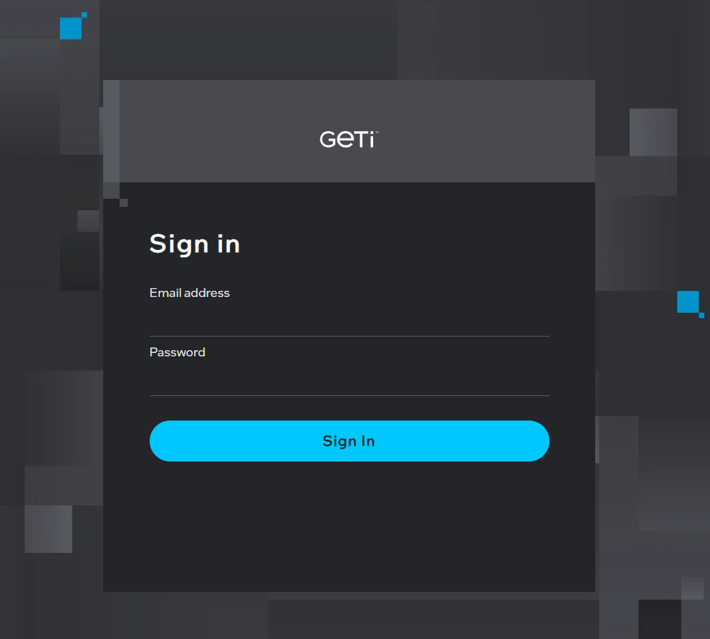

### Step 5: Access Geti™ Dashboard

After successful authentication, you'll see the Geti™ dashboard:

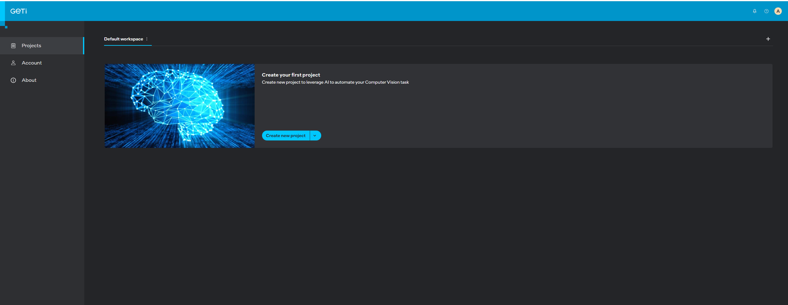

### Step 6: Create a New Project

Click on "Create New Project" to start a new pallet defect detection project:

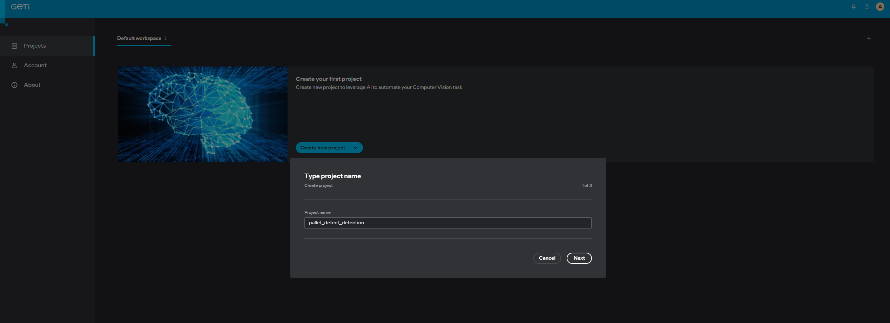

For detailed information refer the tutorial: [Geti™ - Project Creation](https://docs.geti.intel.com/docs/user-guide/geti-fundamentals/project-management/#project-creation)

### Step 7: Select Detection Task

Select "Detection" and choose "Detection bounding box" as your annotation type:

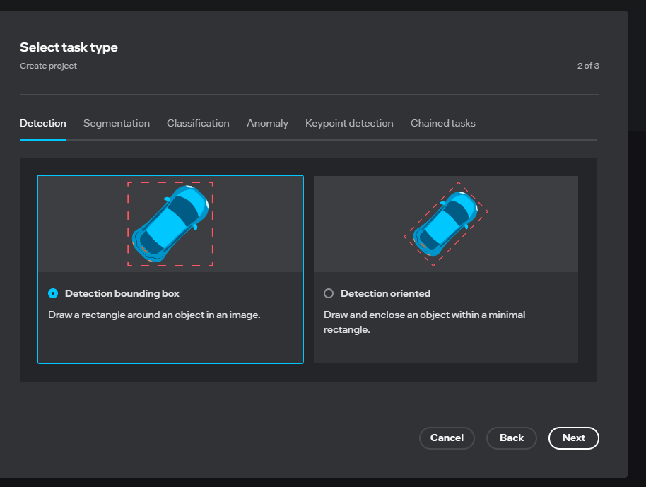

### Step 8: Create Labels

Define the labels for your defect detection task (e.g., "defect", "box", "shipping label" etc.):

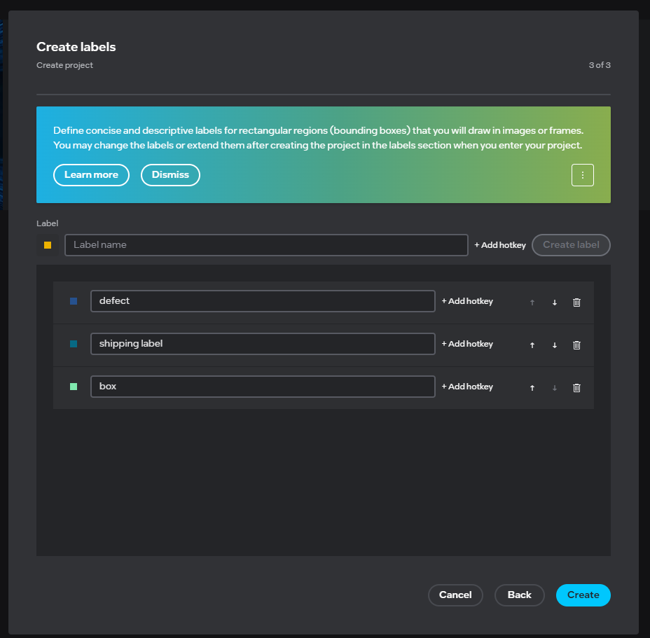

For detailed information refer the tutorial: [Geti™ - Label Management](https://docs.geti.intel.com/docs/user-guide/geti-fundamentals/labels/labels-management)

## Data Annotation and Training

For comprehensive tutorials on data annotation and training workflows, refer to the [Geti™ Tutorials Documentation](https://docs.geti.intel.com/docs/user-guide/getting-started/use-geti/tutorials).

### Step 9: Upload Training Images

Browse and upload your training dataset images:

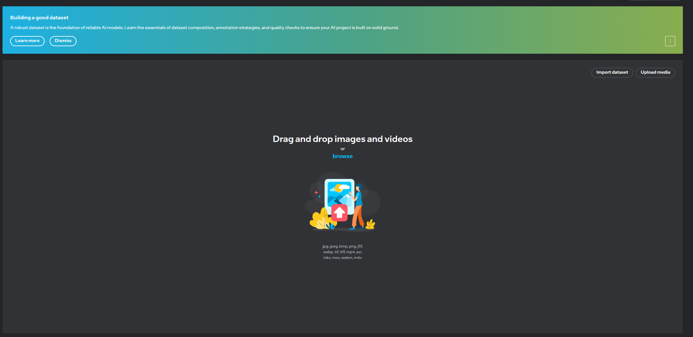

After uploading, your project dashboard will display the uploaded images:

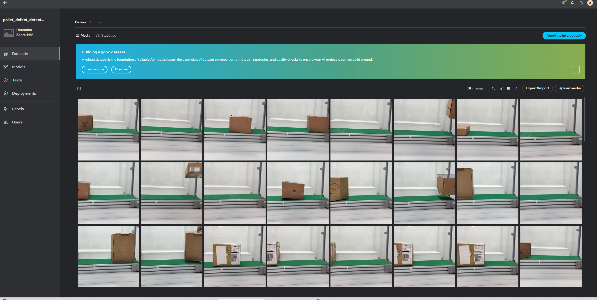

### Step 10: Annotate Images Interactively

Click on "Annotate Interactively" on the top right side of the dashboard. Begin annotating your images manually:

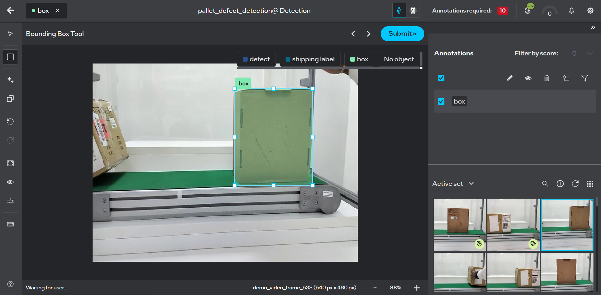

After annotating a few frames, Geti™ will automatically start training the model.

> **Note:** By default, Geti™ uses **MobileNetV2-ATSS** as the model backbone for your detection task. For more control over your model training, you can explore the [Advanced Guide](#advanced-guide) section below to:
> - Change model backbone to different architectures
> - Configure custom training parameters
> - Apply model optimization techniques (FP16, INT8)

### Step 11: Monitor Training Progress

You can monitor the model training progress in real-time:

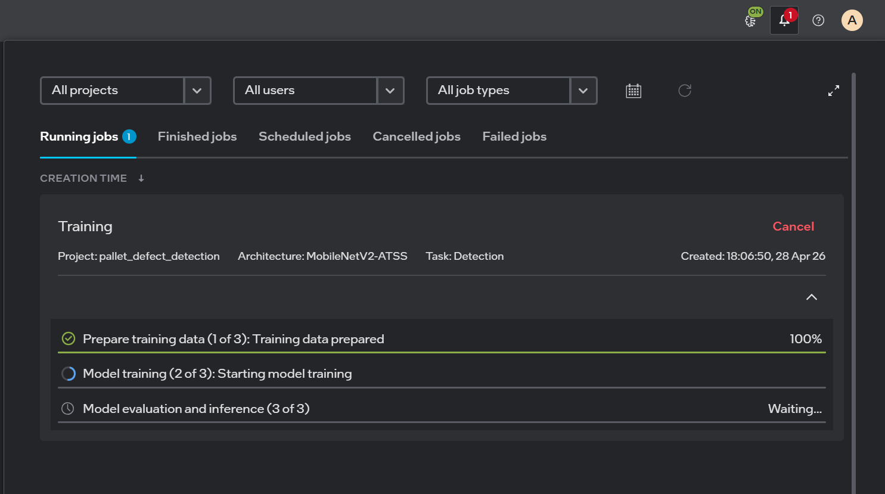

### Step 12: Improve Model Accuracy (Optional)

Repeat the annotation process to improve model accuracy. More annotated data will lead to better model performance.


## Advanced Guide

The Advanced Guide section allows you to fine-tune your model training with more control over model architecture, parameters, and optimization.

### Model Backbone Change

Change the model backbone from the default architecture to other architectures for your specific requirements. For a complete list of supported model architectures, refer to [Geti™ - Supported Models Documentation](https://docs.geti.intel.com/docs/user-guide/getting-started/use-geti/supported-models).

1. Click on **Models** from the left sidebar
2. Select **Train Model**
3. Click on **Advanced Settings**
4. Select your desired model type from the available options:
   - **YOLOX-Tiny**: Lightweight model for edge devices
   - **YOLOX-Small**: Small model with better accuracy
   - Other available backbone architectures
5. Click **Start** to begin training with your selected backbone


For detailed information, refer the tutorial: [Geti™ - Model Training and Optimization](https://docs.geti.intel.com/docs/user-guide/geti-fundamentals/model-training-and-optimization/)
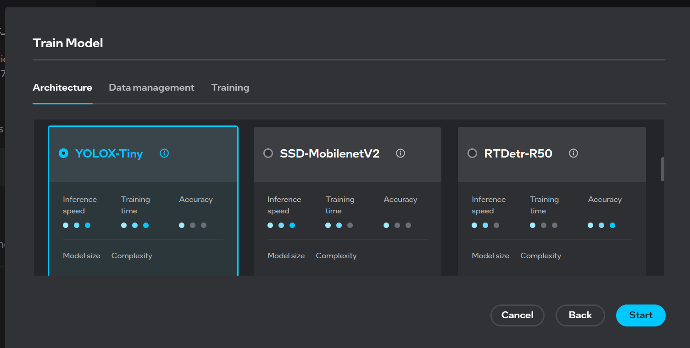

Monitor your selected backbone training progress:

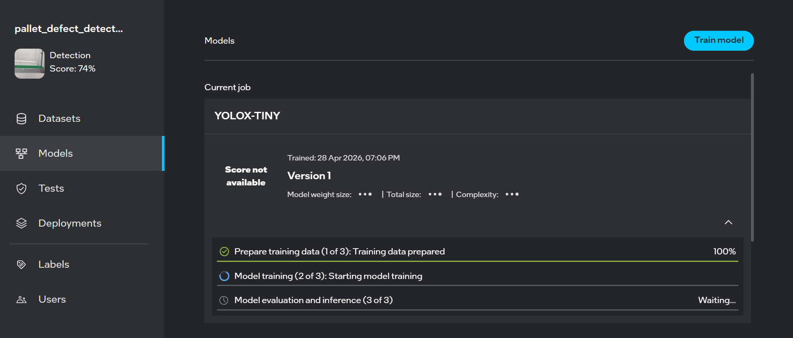

### Train Parameters

Configure custom training parameters to optimize model performance based on your dataset and requirements. For detailed information on available training parameters and their configurations, refer to [Training Parameters Documentation](https://docs.geti.intel.com/docs/user-guide/model-training/training-parameters).

Common parameters include:
- Learning rate
- Batch size
- Number of epochs
- Optimizer settings
- Augmentation options

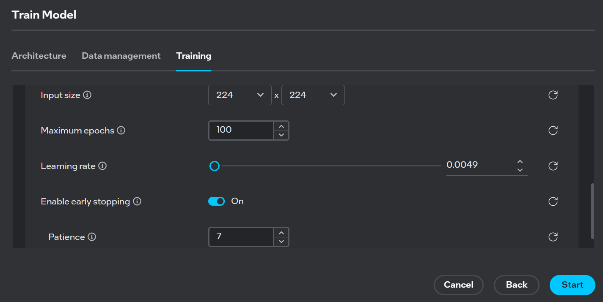

### Model Optimization

After training completes, optimize your model for different deployment scenarios using quantization techniques. Choose the optimization level that best suits your deployment environment:

- **FP16**: Higher precision with good accuracy, requires more computational resources
- **INT8**: Optimized for edge deployment, significantly reduces model size and latency

Click on **Start Optimization** to generate your optimized model:

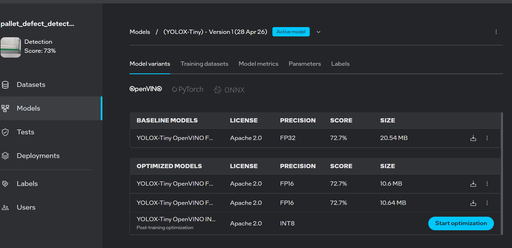


After optimization, proceed with downloading and deploying your model.

#### Download Model

Click on the download icon next to the FP16 or INT8 model. A zip folder containing `model.bin` and `model.xml` will be downloaded. Replace the existing model files in your deployment resources:

```
model.bin  <- Replace with downloaded version
model.xml  <- Replace with downloaded version
```
For detailed information, refer to the tutorial: [Geti™ - Model Download](https://docs.geti.intel.com/docs/user-guide/geti-fundamentals/deployments/)

Alternatively, you can download the entire deployment folder and replace the existing deployment folder in your resources:

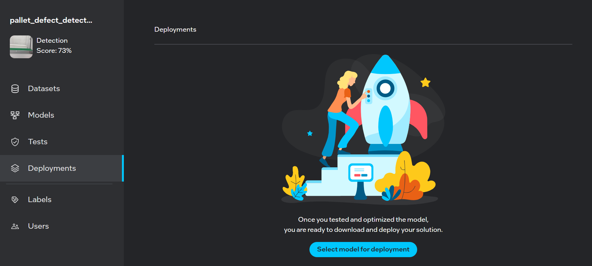


Navigate to **Deployments** and click **Select model for deployment**:

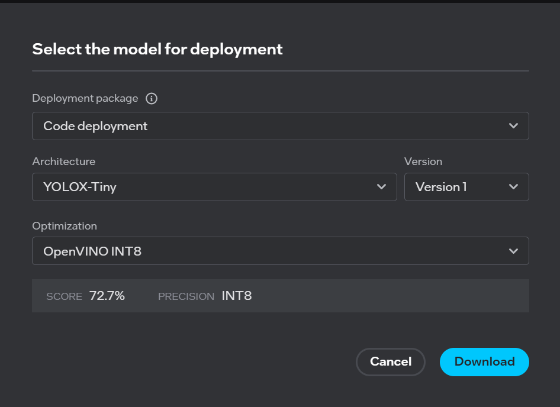

In the "Select model for deployment" dialog:

1. Choose your desired **Architecture**
2. Select your **Optimization** level (FP16 or INT8)
3. Click **Download**

The deployment package will be downloaded. Replace the existing deployment folder inside your resources with this new package.

## Next Steps

- Deploy the model to edge devices
- Monitor model performance
- Continuously improve accuracy by adding more annotated data
- Retrain as needed with new data

## Troubleshooting

For installation issues, refer to the [Geti™ Installation Guide](https://docs.geti.intel.com/docs/user-guide/getting-started/installation/using-geti-installer).
