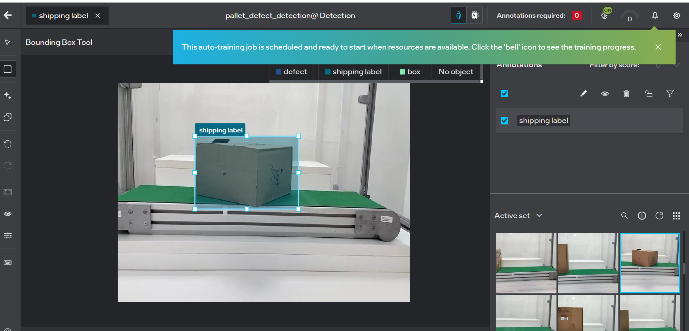

# Generating Model from Geti

This guide walks you through the process of installing Geti, setting up a pallet defect detection project, training a model, and deploying it.

## Prerequisites

- A system capable of running Geti Platform
- Internet connection for downloading Geti and datasets
- Access to images for training your defect detection model

## Installation Steps

### Step 1: Install Geti Platform

Download the Geti platform installer:

```bash
curl -LO https://storage.geti.intel.com/$(curl -L -s https://storage.geti.intel.com/latest.txt)/platform_installer.tar.gz
```

Extract the installer:

```bash
tar -xf platform_installer.tar.gz
```

### Step 2: Prepare System

Clean and prepare the data directory:

```bash
sudo rm -rf /data
sudo mkdir /data
```

### Step 3: Run Platform Installer

Navigate to the installer directory and run the installation:

```bash
cd platform_2.13.1/
sudo ./platform_installer install
```


## Setting Up Your Project

### Step 4: Sign In to Geti

Open `https://<host_ip>` in your browser, where `<host_ip>` is the IP address of the system where you installed Geti server. Sign in with your credentials:


### Step 5: Access Geti Dashboard

After successful authentication, you'll see the Geti dashboard:


### Step 6: Create a New Project

Click on "Create New Project" to start a new pallet defect detection project:


### Step 7: Select Detection Task

Select "Detection" and choose "Detection bounding box" as your annotation type:


### Step 8: Create Labels

Define the labels for your defect detection task (e.g., "defect", "box", "shipping label" etc.):


## Data Annotation and Training

### Step 9: Upload Training Images

Browse and upload your training dataset images:


After uploading, your project dashboard will display the uploaded images:


### Step 10: Annotate Images Interactively

Click on "Annotate Interactively" on the top right side of the dashboard. Begin annotating your images manually:


### Step 11: Auto-Training Begins

After annotating a few frames, Geti will automatically start training the model:



### Step 12: Monitor Training Progress

You can monitor the model training progress in real-time:


### Step 13: Improve Model Accuracy (Optional)

Repeat the annotation process to improve model accuracy. More annotated data will lead to better model performance.

## Advanced Model Training

### Step 14: Train with Specific Model Type

For advanced training options:

1. Click on **Models** from the left sidebar
2. Select **Train Model**
3. Click on **Advanced Settings**
4. Select your desired model type (e.g., **YOLOX-Tiny**)
5. Click **Start** to begin training


### Step 15: Monitor YOLOX-Tiny Training

Watch the YOLOX-Tiny model being trained:


## Model Optimization and Deployment

### Step 16: Select Model Optimization

After training completes, you can optimize the model for your requirements:

- **FP16**: Higher precision, requires more resources
- **INT8**: Optimized for edge deployment, reduces model size and latency

Click on **Start Optimization** to generate your optimized model:


### Step 17: Download Model

Click on the download icon next to the FP16 or INT8 model. A zip folder containing `model.bin` and `model.xml` will be downloaded. Replace the existing model files in your deployment resources:

```
model.bin  <- Replace with downloaded version
model.xml  <- Replace with downloaded version
```

### Step 18: Prepare for Deployment

Alternatively, you can download the entire deployment folder and replace the existing deployment folder in your resources:


### Step 19: Select Model for Deployment

Navigate to **Deployments** and click **Select model for deployment**:


### Step 20: Download Deployment Package

In the "Select model for deployment" dialog:

1. Choose your desired **Architecture**
2. Select your **Optimization** level (FP16 or INT8)
3. Click **Download**

The deployment package will be downloaded. Replace the existing deployment folder inside your resources with this new package.

## Next Steps

- Deploy the model to edge devices
- Monitor model performance
- Continuously improve accuracy by adding more annotated data
- Retrain as needed with new data

## Troubleshooting

For installation issues, refer to the [Geti Installation Guide](https://docs.geti.intel.com/docs/user-guide/getting-started/installation/using-geti-installer).
